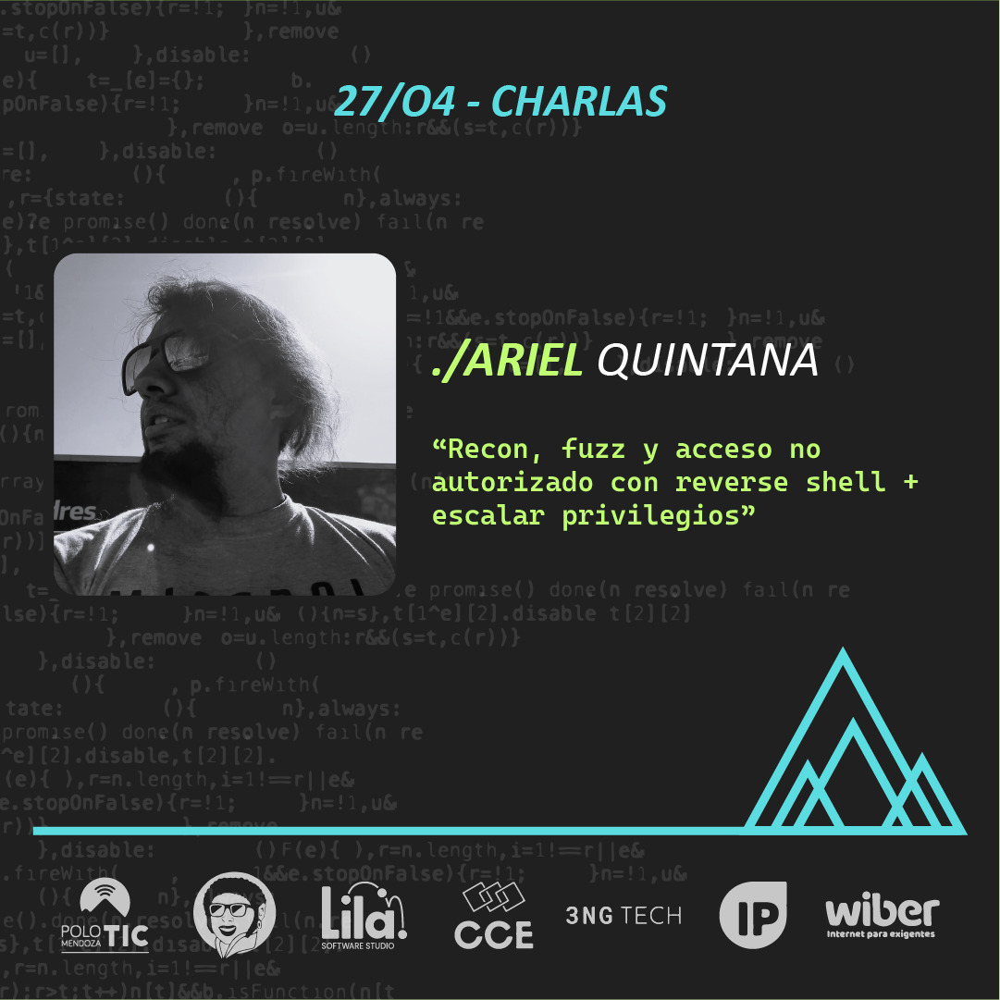

# MDZ.2024 - Evento de informáticos Mendoza

Nos entusiasma presentar a **Ariel Quintana**, un intrépido Sysadmin & DevOps que se sumerge en el emocionante mundo del Red Team y Hacking Ético. Ariel nos brindará una charla intensa y reveladora titulada “**Recon, Fuzz y Acceso No Autorizado con Reverse Shell + Escalar Privilegios**”, donde explorará técnicas avanzadas y estrategias para fortalecer la seguridad informática.

