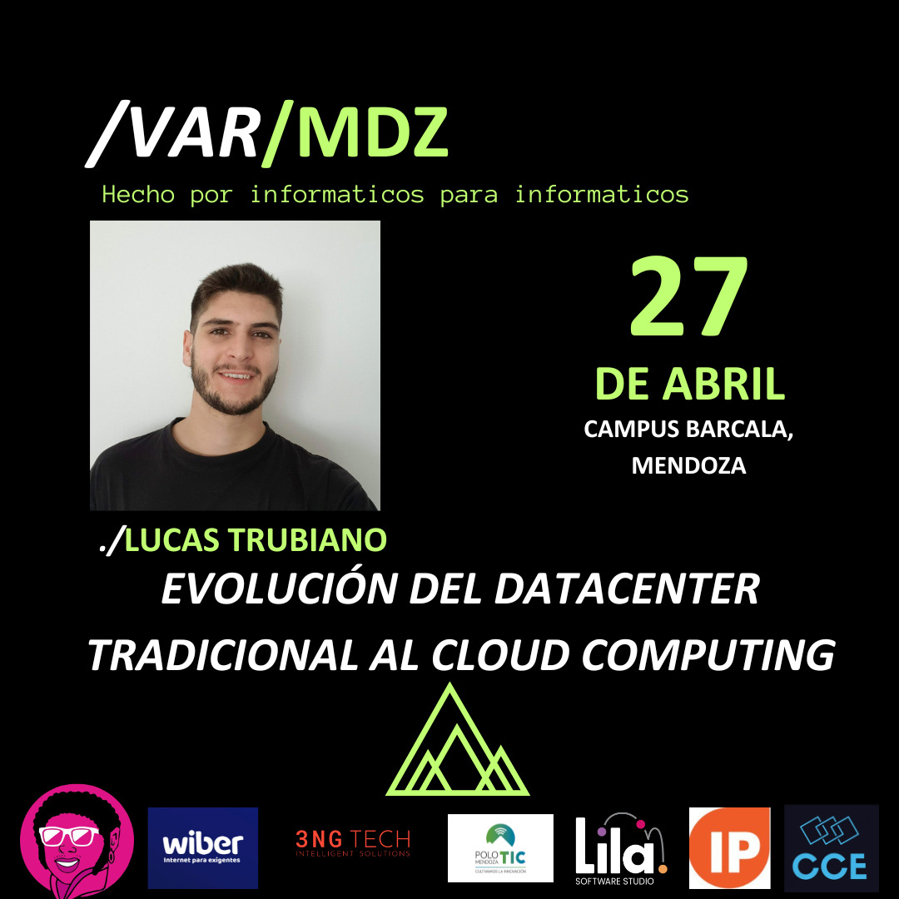

# MDZ.2024 - Evento de informáticos Mendoza

Nos complace anunciar a **Lucas Trubiano**, un destacado Profesor y Consultor en Ingeniería de Datos y Nube (Data Engineering & Cloud). Lucas nos ofrecerá una charla fascinante titulada “**Evolución del datacenter Tradicional al Cloud Computing**”, donde explorará los cambios y avances en el mundo del almacenamiento y procesamiento de datos.

