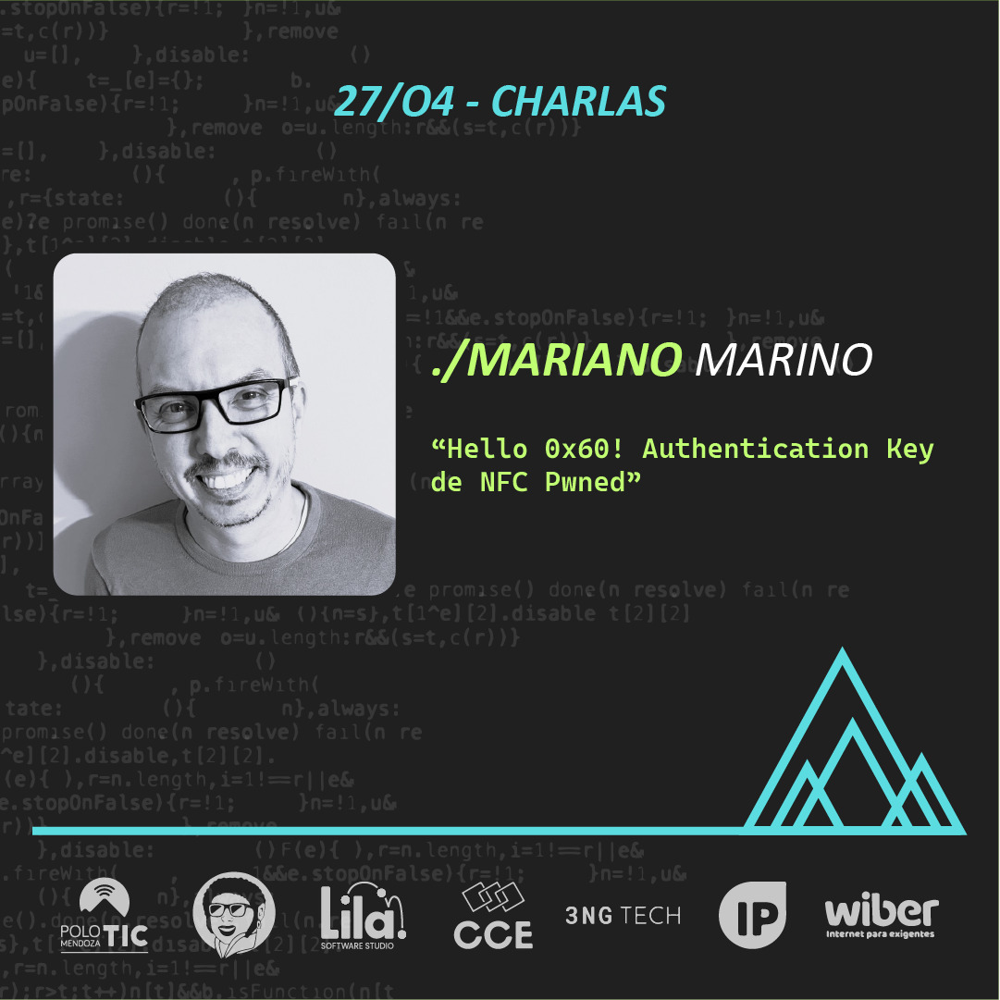

# MDZ.2024 - Evento de informáticos Mendoza

Estamos emocionados de presentar a **Mariano Marino**, un experimentado Programador y Consultor en Seguridad. Mariano nos ofrecerá una charla intrigante titulada:

**Hello 0x60! Authentication Key de NFC Pwned.**

¿Te gustaría saber cómo llevar a cabo una investigación en un dispositivo que tengas y no morir en el intento? En esta charla aplicaremos método científico para analizar los circuitos integrados de la marca NXP, líder en la industria de NFC, con el fin de conseguir las claves de autenticación utilizadas para acceder a los sectores protegidos de un tag NFC.

