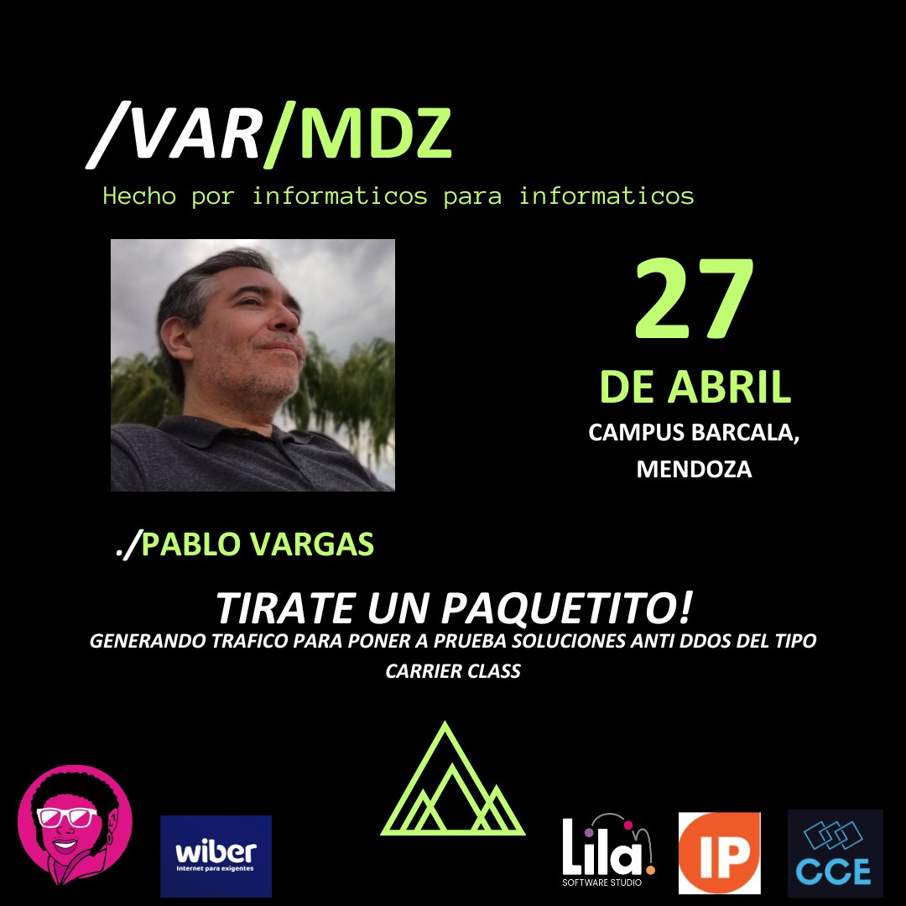

# MDZ.2024 - Evento de informáticos Mendoza

Presentamos a un amigo de la comunidad **Pablo Vargas**, un experto en Sysadmin, DevSecOps, y un profesor apasionado. Únete a nosotros mientras nos presenta "**Tirate un paquetito! Generando tráfico para poner a prueba soluciones Anti DDOS del tipo Carrier Class**". ¡No te lo pierdas! 💻🌐

