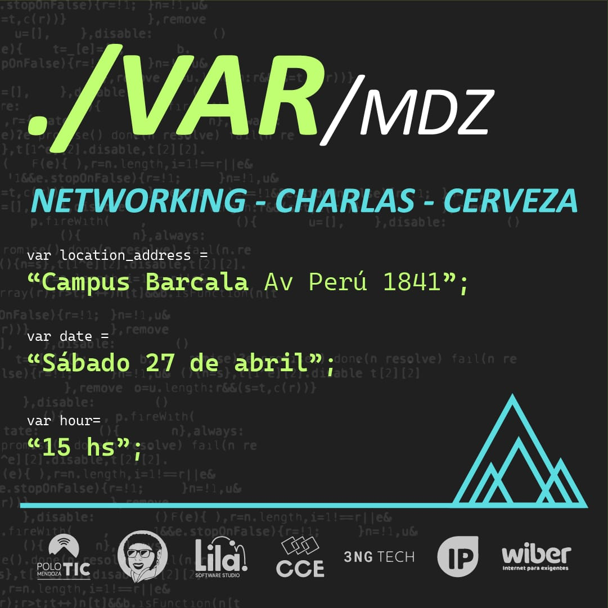
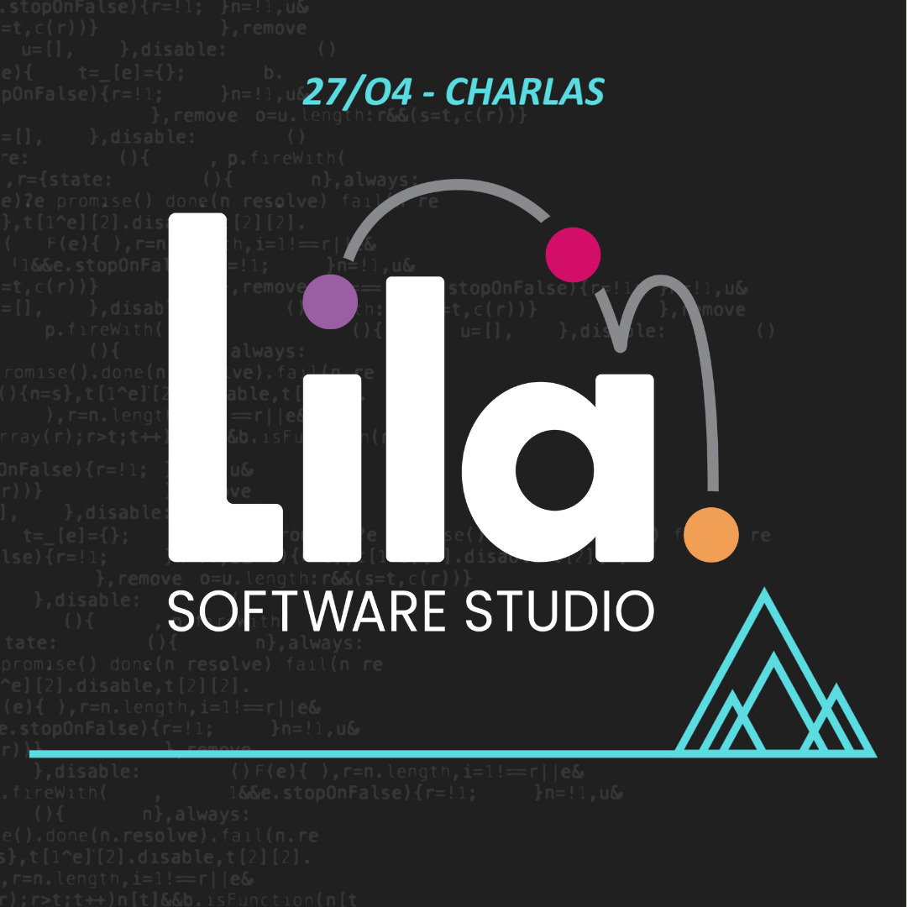
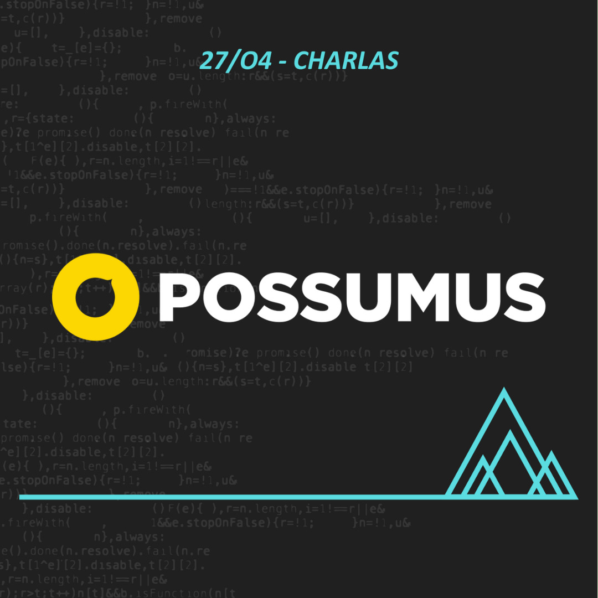

# MDZ.2024 - Evento de informáticos Mendoza

Les traemos un evento imperdible para todos los apasionados de la tecnología y la innovación en Mendoza. Tenemos un line-up de charlas increíbles con expertos destacados en sus respectivos campos.

- **Adrian Velazquez** - ["Microsoft Fabric: Análisis de datos en la era de la IA"](AdrianVelazquez)
- **Ariel Quintana** - ["Recon, fuzz y acceso no autorizado con reverse shell + escalar privilegios"](ArielQuintana)
- **Arturo Baldo** - ["Se cayó el Sistema"](ArturoBaldo)
- **Francesco Gentile** - ["Construyendo servidores de HTTP"](FrancescoGentile)
- **Lucas Trubiano** - ["Evolución del datacenter Tradicional al Cloud Computing"](LucasTrubiano)
- **Mariano Marino** - ["Hello 0x60! Authentication Key de NFC Pwned"](MarianoMarino)
- **Marisol Herrera** - ["IA vs IE: ¿Qué habilidades serán necesarias en este nuevo panorama laboral mundial?"](MarisolHerrera)
- **Pablo Fredrikson** - ["Kubernetes, ¿tu solución o tu problema?"](PabloFredrikson)
- **Pablo Vargas** - ["Tirate un paquetito! Generando tráfico para poner a prueba soluciones anti DDoS del tipo Carrier Class"](PabloVargas)
- **Renzo Guarise** - ["El desarrollo de código en proyectos de Machine Learning e IA"](RenzoGuarise)

No se pierdan esta oportunidad única de aprender, conectar con otros profesionales y sumergirse en las últimas tendencias y desarrollos tecnológicos.

|  |  |
|--------------------------|--------------------------|
|  |  |
