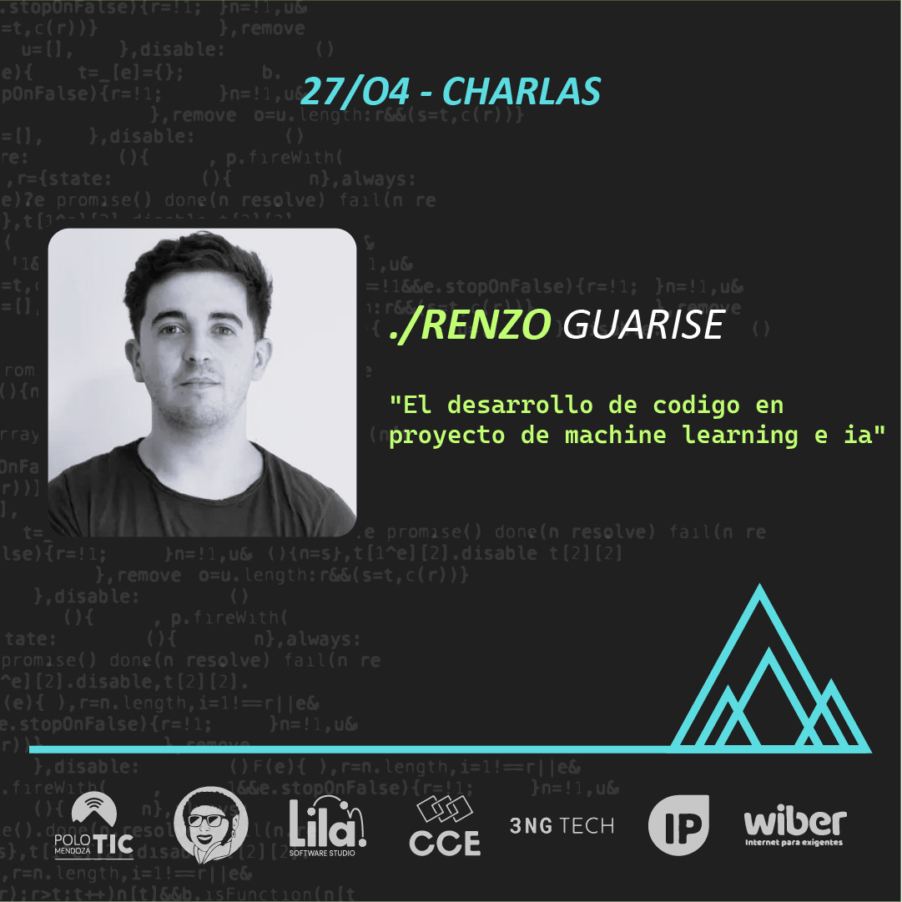

# MDZ.2024 - Evento de informáticos Mendoza

Estamos emocionados de presentar a **Renzo Guarise**, un destacado Machine Learning Engineer en MercadoLibre y CTO en 3ngTech. Renzo nos ofrecerá una charla innovadora titulada "**El desarrollo de código en proyectos de Machine Learning e IA**", donde compartirá insights y mejores prácticas sobre cómo abordar y optimizar el desarrollo de proyectos de inteligencia artificial y machine learning.

